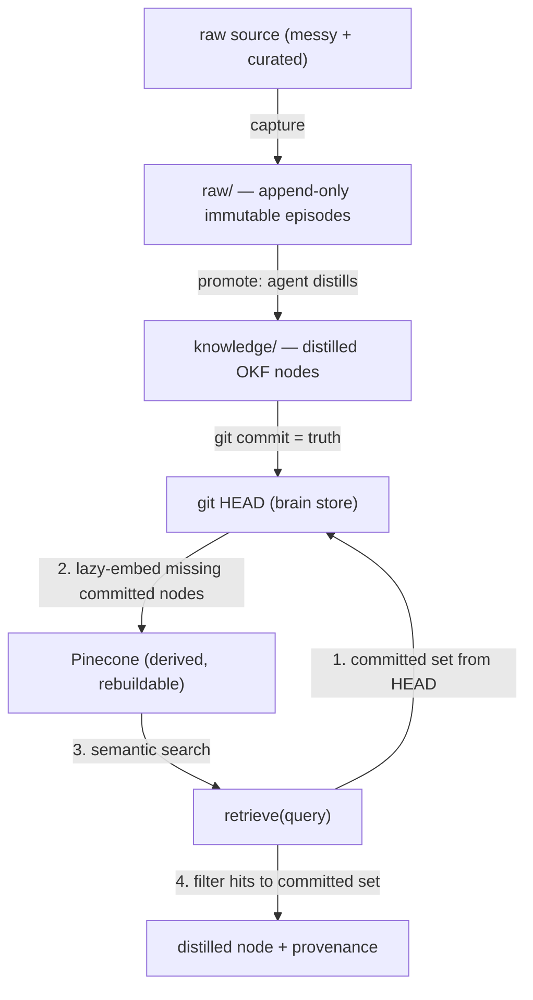

# Memory Walking Skeleton - Plan

## Goal Capsule

- **Objective:** Build the thinnest end-to-end `capture → promote → retrieve` memory loop — every verb real, running on Jarod's actual research — and demo it by **Sun Jul 26 (Sprint 1)**.
- **Product authority:** Jarod.
- **Open blockers:** the embed-on-commit trigger is unchosen; the *contents* of the demo payoff moment and the 5–10 eval cases aren't pinned yet. The requirement that they exist is committed (R14, R15) — only the specifics are open. See Outstanding Questions.

---

## Product Contract

### Summary

A single MCP server exposes three verbs: `capture` ingests a raw source into an immutable episodic tier, `promote` distills a keeper into a reviewed, git-backed knowledge node, and `retrieve` semantically recalls that distilled truth with a link back to where it came from. The Sprint 1 demo runs the whole loop on Jarod's real Agent Memory System research.

### Problem Frame

Every agent session starts cold, and most "memory" tools answer that by dumping raw transcripts back into context. That is the pattern the "Stop Calling it Memory" critique names: search-over-notes with no curation. It scales badly and it never becomes trustworthy knowledge.

The value is not in storing more — it is in the **membrane** between raw episodes and durable truth. Raw material is captured and kept forever; only reviewed, distilled knowledge is promoted into a clean human-readable layer that any harness can retrieve. The demo has to make that membrane visible on real content, not argue it in the abstract.

### Key Decisions

- **Full boundary in miniature; the substrate is the product, not the summarizing.** All three verbs are real and thin. The distillation prose is written by the calling agent (Claude), so agent-brain's defensible layer is the **boundary + retrieval + provenance**, not summary quality. The demo stars "a cold session recalls committed truth with a link home; nothing is retrievable until promoted" — never "look how well it summarized."
- **Git commit is the promotion gate.** `promote` writes a working file; truth exists only once it is committed to the brain store's git history. Git diff is the review surface — no review UI to build, and it matches how Jarod already ships docs.
- **Pinecone indexes distilled truth only (Sprint 1).** Pinecone does one job: fast semantic search over promoted nodes. The raw tier is not embedded. The massive raw-archive recall is a later layer.
- **The raw tier is immutable and append-only, owned by agent-brain.** Every braindump or later edit is a new capture, never a mutation. This is the episodic history, and it makes provenance unbreakable (a raw episode never moves or changes) and the eval corpus deterministic by construction.
- **The L2 knowledge layer is curated current truth, not a timeline.** When knowledge evolves, a node is reconciled to reality; it never accretes a "on Jul 21 I thought X" changelog. History lives in raw; meaning lives in L2.
- **Nodes get a stable identity now — a northstar bet, not exercised this sprint.** `promote` writes each node to a deterministic slug derived from its title, not a throwaway filename. This is a near-free seam (barely more than `slugify + date`) that lets the future maintenance layer reconcile a node in place instead of spawning duplicates. Sprint 1 does only first-time promotion, so the seam is *not* validated this sprint — reconciliation stays deferred. It's a deliberate low-cost bet, not a proven mechanism.
- **The brain store lives outside this public repo, and the boundary is enforced.** Both the raw tier and the distilled nodes are personal; they cannot land in the public `agent-brain` product repo. The skeleton writes to a separate, configurable, git-backed store, and refuses to run if that path resolves inside the public repo.
- **Pinecone is a third-party processor of distilled content.** Promoted nodes — distilled, but still personal — are sent to Pinecone, a vendor with its own retention and access posture. "Not in the public repo" is not the same as "safe to disclose externally": only distilled north-star research prose is acceptable to send; no secrets or raw personal detail beyond that.

### Actors

- A1. **Jarod** — provides raw sources for A2 to capture, reviews distilled nodes at the git-diff gate, and commits to promote them to truth.
- A2. **Calling agent (Claude-in-harness)** — invokes the verbs and authors the distilled prose during `promote`.
- A3. **agent-brain (the substrate)** — owns the raw tier, scaffolds nodes, handles storage and embedding, serves retrieval. Holds no LLM of its own.

### Key Flows

- F1. **Capture**
  - **Trigger:** A2 calls `capture` on a raw source.
  - **Steps:** agent-brain copies the source into the append-only raw tier, assigns a stable episode id, and records origin path + timestamp.
  - **Outcome:** An immutable raw episode exists; nothing is retrievable yet.
  - **Covered by:** R1, R2, R3
- F2. **Promote and commit**
  - **Trigger:** A2 calls `promote` on a raw episode.
  - **Steps:** A2 authors distilled prose; agent-brain writes it into an OKF node at a deterministic slug in the brain store (uncommitted). A1 reviews the diff and commits. Committing makes the node embeddable; the next `retrieve` lazy-embeds it (KTD1).
  - **Outcome:** The node is durable truth and semantically retrievable.
  - **Covered by:** R4, R5, R6, R7, R12
- F3. **Retrieve**
  - **Trigger:** A2 (often a fresh, cold session) calls `retrieve` with a query.
  - **Steps:** agent-brain runs semantic search over committed nodes and returns matches with provenance to the originating raw episode.
  - **Outcome:** Distilled truth recalled with a link home; un-promoted content is invisible.
  - **Covered by:** R8, R9

### Requirements

**Capture**
- R1. `capture` ingests a raw source into an append-only, immutable raw tier that agent-brain owns; nothing in that tier is ever mutated or deleted.
- R2. Each captured episode receives a stable id and records its origin (source path + capture timestamp) for provenance.
- R3. A later edit or re-braindump of the same source is a new capture (a new episode), never an update to an existing one.

**Promote**
- R4. `promote` reads a raw episode and produces a distilled, human-readable L2 node with OKF frontmatter (`type`, `title`, `description`, `tags`), written to a working file that is not yet committed.
- R5. The calling agent authors the distilled prose; agent-brain supplies the node scaffold and persists it, holding no embedded LLM.
- R6. `promote` writes each node to a stable, deterministic identity (slug) so a node can be reconciled in place later rather than duplicated.
- R7. A node becomes durable truth only when it is committed to the brain store's git history.

**Retrieve**
- R8. `retrieve` runs semantic search and returns only nodes whose promotion is committed to the brain store's git history — never uncommitted working files, and never a Pinecone entry lacking a committed node — with provenance back to the originating raw episode.
- R9. Un-promoted (uncommitted) content is never retrievable — git-committed status, not mere presence in Pinecone or on disk, is what makes a node "known".

**Boundary and storage**
- R10. The brain store — both the immutable raw tier and the distilled L2 nodes — lives outside the public agent-brain repo, at a configurable path, and is itself a git repo so the git-diff gate applies. `capture` and `promote` verify the configured path resolves outside (and not nested inside) the public repo's working tree, and refuse to operate otherwise — the boundary is enforced, not just documented.
- R11. Pinecone indexes only the distilled L2 nodes; the raw tier is not embedded.
- R12. Committing a node projects it into Pinecone as part of the promotion-to-truth step. The exact trigger is unresolved (Outstanding Questions).
- R13. Add `docs/NORTHSTAR-SOURCES.local.md` (gitignored) cataloging the northstar raw material — the Obsidian Agent Memory System research and the IBOS graphify — as the brain's **intake backlog** (dogfood to capture → promote when ready), plus a one-line pointer in `docs/START-HERE.md`. It doubles as the breadcrumb to where the northstar thinking lives. No private paths appear in committed docs.

**Demo and eval**
- R14. The demo runs the full loop on Jarod's real material — including at least one genuinely messy source (a transcript, voice-memo braindump, or thread) alongside the curated AMS research — so `promote` is visibly seen turning mess into a clean node. It stages the membrane as a state-flip: the same cold query returns nothing before promote, then the distilled answer with a link home after commit.
- R15. A 5–10 case eval set exercises `retrieve` against a frozen promoted corpus.

### Acceptance Examples

- AE1. **The payoff.** **Covers R8, R14.**
  - **Given:** the AMS research is captured, promoted, and committed.
  - **When:** a fresh session asks "what's my north star for the memory system?"
  - **Then:** `retrieve` returns the distilled node with provenance to the source note.
- AE2. **The boundary guardrail.** **Covers R7, R9.**
  - **Given:** a node distilled by `promote` but not yet committed.
  - **When:** `retrieve` is called for it.
  - **Then:** it returns nothing.
- AE3. **Immutable raw.** **Covers R1, R3.**
  - **Given:** a source captured on day 1.
  - **When:** the source is later edited and re-captured.
  - **Then:** a second episode exists and the first is unchanged.
- AE4. **The membrane, shown as a flip.** **Covers R8, R9, R14.**
  - **Given:** a messy source captured but not yet promoted.
  - **When:** the same cold query runs before promote and again after commit.
  - **Then:** before → nothing; after → the distilled node with provenance to the source.

### Scope Boundaries

**Deferred for later (northstar, not v1)**
- Raw-archive recall — embedding the full raw pile for on-demand episodic search. The Sprint 2 wow.
- Cross-harness fan-out — Sprint 2.
- The reconciliation / OODA loop — detecting when new raw updates an existing node, plus linting (contradictions, broken links) and wagers.
- Graph and SQLite layers.

**Outside this product's identity**
- Distillation quality as the product's value — the intelligence is the harness's; agent-brain is the substrate.
- L2 as a live mirror of source files — L2 is curated truth, not a vault reflection.

### Success Criteria

- The full `capture → promote → commit → retrieve` loop runs end-to-end on real AMS content by the Sprint 1 demo (Sun Jul 26).
- The boundary holds observably: un-promoted content is not retrievable; committed truth is.
- A viewer can attribute the demo's value to agent-brain specifically — the enforced commit-gate boundary and provenance integrity — not merely to Claude's prose, Pinecone's search, or git.
- `retrieve` returns correct provenance across the frozen eval set.
- A post-demo cold session shows `retrieve` materially helping real work — evidence the brain is worth reopening, not just a demo that passed.
- No personal AMS content lands in the public repo.

### Outstanding Questions

**Resolved during planning**
- Embed-on-commit trigger → KTD1 (lazy-embed on retrieve). Distillation scaffold → KTD4. Node-slug scheme → KTD6. Brain-store path + git init → U1/KTD5.

**Deferred to implementation**
- **Demo-payoff + eval-case contents** (R14/R15 committed; their specifics are authored in U6, with the promoted corpus frozen first so eval isn't a moving target).
- **Build-in-public redaction:** what AMS content is safe to show in screenshots/recordings vs must be redacted.
- **Pinecone specifics:** exact integrated-embedding model + index params — verify against live docs at implementation (U4).

### Sources / Research

- Jarod's Obsidian **Agent Memory System** research — northstar and the 6-component architecture. Local and private; indexed via `docs/NORTHSTAR-SOURCES.local.md`.
- **IBOS Surface Boundary Trace** — the L2/L3 cut, the six-type promotion taxonomy, and "keep everything raw, promote selectively." The model this borrows.
- **Karpathy LLM Wiki** pattern — immutable `raw/`, curated OKF nodes. The Substack "Stop Calling it Memory" critique names the anti-pattern this avoids.
- Repo state: `src/index.ts` (three MCP stubs), `docs/DECISIONS.md`, `docs/START-HERE.md`.

---

## Planning Contract

**Product Contract preservation:** changed — F2's flow step was clarified to match KTD1 (lazy-embed on retrieve, not a commit-time projection); no requirement, ID, or scope change. All other Product Contract content unchanged.

### Key Technical Decisions

- **KTD1 — Embed-on-commit = lazy-embed on retrieve.** `retrieve` computes the committed L2 node set from git `HEAD`, embeds any committed node not yet in Pinecone, then queries and filters results to that set. Chosen over an explicit `sync` verb (reopens the committed-but-unsynced window R8/R9 close) and a post-commit git hook (brittle to build/demo, needs a Pinecone key at commit time, dominated at scale). Lazy-embed uniquely honors *committed ⇒ retrievable with no manual step*, so AE4's flip needs zero on-camera steps. The trigger is reversible because correctness lives in R8's committed-status gate, not in the trigger.
- **KTD2 — "Committed" resolves to `HEAD` of the brain store, never the process working directory.** The committed set derives from git `HEAD` over the L2 directory, invoked against the resolved store path (`git -C <storePath> ls-tree -r HEAD -- knowledge/`). Git is always targeted with `-C` (or a spawn `cwd`), never the process's working directory — which is the *public* repo. No git library is added; use Bun's `$`/`Bun.spawn`. A promoted-but-uncommitted node is on disk but not in `HEAD`, so it is neither embedded nor returned — the mechanism behind R9 and AE2.
- **KTD3 — Pinecone is an integrated-embedding index with a flat record schema.** Use `create-index-for-model` so agent-brain never runs an embedding model itself. Records are flat: an id, the text field named in the index `fieldMap`, and provenance as flat scalar fields (values limited to string/number/boolean/string-array; no nested objects). Target a single default namespace. Exact embedding model, index params, and the field/namespace API shape are verified at implementation via the `pinecone:docs` skill; guard `create-index-for-model` with a describe-first idempotency check.
- **KTD4 — The calling agent authors distilled prose; agent-brain owns the scaffold.** `promote` writes an OKF node template (frontmatter + provenance) that the calling agent fills with distilled prose. agent-brain performs the write, slug derivation, storage, and embedding — it holds no LLM. Keeps the substrate LLM-dependency-free.
- **KTD5 — Boundary enforced by path validation, not convention.** `capture` and `promote` resolve the configured brain-store path and refuse to operate if it is inside — or nested inside — the public repo's working tree. The enforcement behind R10 and the "no personal content in the public repo" criterion.
- **KTD6 — Deterministic slug for node identity.** `promote` derives each node's filename from a slug of its title (`slugify`-shaped, near-free). The unexercised northstar seam — Sprint 1 does first-time promotion only; reconciliation stays deferred.

### High-Level Technical Design

The membrane: raw flows up into distilled truth only through `promote` + a human `git commit`; retrieval reads committed truth and treats Pinecone as a rebuildable accelerator, never canonical. The MCP server lives in the public repo; the raw tier and L2 nodes live in a separate private git store (KTD5).

---

## Implementation Units

### U1. Brain-store resolution and boundary enforcement
- **Goal:** Resolve the configurable external brain-store path and refuse to operate unless it is a git repo outside the public repo's tree.
- **Requirements:** R10; KTD5.
- **Dependencies:** none.
- **Files:** `src/store.ts`, `src/store.test.ts`, `.env.example` (add `AGENT_BRAIN_STORE`).
- **Approach:** Read the store path from env/config. Verify it exists, is a git working tree, and does not resolve inside (or nested inside) the public repo's working tree; throw a clear error otherwise. Expose helpers for the `raw/` and `knowledge/` (L2) dirs.
- **Patterns to follow:** the stderr-only logging + error-exit pattern in `src/index.ts`.
- **Test scenarios:**
  - Happy: a valid external git repo path resolves to raw/ and L2 dir handles.
  - Boundary refusal: a path inside the public repo's tree → refuses with a clear error. `Covers R10.`
  - Boundary refusal: a path nested inside the public repo → refuses with a clear error. `Covers R10.`
  - Error: non-existent path, or a path that is not a git repo → clear error.

### U2. Raw tier and `capture`
- **Goal:** Ingest a raw source into an append-only, immutable raw tier with a stable episode id and provenance.
- **Requirements:** R1, R2, R3; F1.
- **Dependencies:** U1.
- **Files:** `src/capture.ts`, `src/capture.test.ts`, `src/index.ts` (wire the real `capture` tool).
- **Approach:** Copy the source into `raw/<episode-id>` in the brain store; never mutate or delete. Assign a stable episode id; record origin path + capture timestamp. A re-capture of the same source is a new episode.
- **Test scenarios:**
  - Happy: capturing a source writes an immutable raw episode with id + provenance. `Covers R1, R2.`
  - Immutable: re-capturing an edited source creates a second episode; the first is byte-unchanged. `Covers R3, AE3.`
  - Edge: an empty/whitespace source records an episode or errors cleanly (pick one and test it).

### U3. `promote` → distilled node scaffold
- **Goal:** From a raw episode, write an uncommitted OKF node at a deterministic slug for the calling agent to fill with distilled prose.
- **Requirements:** R4, R5, R6, R7; F2; KTD4, KTD6.
- **Dependencies:** U2.
- **Files:** `src/promote.ts`, `src/promote.test.ts`, `src/index.ts` (wire real `promote`).
- **Approach:** Given an episode id + agent-authored prose + title/tags, derive a deterministic slug from the title, write `knowledge/<slug>.md` with OKF frontmatter (`type`, `title`, `description`, `tags`) + provenance (episode id, source path) and the prose body. Leave it uncommitted — truth is the human `git commit`.
- **Test scenarios:**
  - Happy: promote writes an OKF node at the title-derived slug with provenance; file is uncommitted. `Covers R4, R6.`
  - Deterministic: same title → same slug (no duplicate spawn).
  - Guard: node body carries agent-authored prose; agent-brain makes no LLM call. `Covers R5.`

### U4. Pinecone integrated-embedding projection
- **Goal:** Project a committed L2 node into a Pinecone integrated-embedding index with a flat record schema.
- **Requirements:** R11, R12; KTD3.
- **Dependencies:** U3.
- **Files:** `src/pinecone.ts`, `src/pinecone.test.ts`.
- **Approach:** Ensure an integrated-embedding index exists (`create-index-for-model`, guarded by a describe-first idempotency check). Upsert a flat record into a single default namespace: id = slug, text field per `fieldMap` = node prose, provenance as flat scalar fields (string/number/boolean/string-array; no nested objects). Only committed nodes are projected (caller passes the committed set).
- **Execution note:** verify the current integrated-embedding model + index params against live Pinecone docs before coding the upsert.
- **Test scenarios:**
  - Happy: a committed node upserts as a flat record retrievable by semantic query.
  - Schema: record has no nested objects and no `metadata` field. `Covers R11.`
  - Integration tests that hit a live/ephemeral index are gated behind an env flag.

### U5. `retrieve` with lazy-embed + HEAD-committed gate
- **Goal:** Return only git-committed nodes, embedding any missing committed node just-in-time, with provenance.
- **Requirements:** R8, R9; F3; KTD1, KTD2; AE1, AE2, AE4.
- **Dependencies:** U4.
- **Files:** `src/retrieve.ts`, `src/retrieve.test.ts`, `src/index.ts` (wire real `retrieve`).
- **Approach:** Compute the committed node set from git `HEAD` over the L2 dir, invoking git against the store path (`git -C <storePath> ls-tree -r HEAD -- knowledge/`; never process cwd — see KTD2). Lazy-embed any committed node not yet in Pinecone (via U4); because integrated-embedding upsert is eventually consistent, follow the upsert with a bounded poll/retry before treating the node as searchable. Run semantic search; filter hits to the committed set; return nodes + provenance. Never return uncommitted or non-committed-backed entries. On a zero-commit store, treat git's `unknown revision` as an empty committed set (return nothing, don't error).
- **Execution note:** start with a failing test for the committed-gate contract (the revert case) before wiring search.
- **Test scenarios:**
  - Happy: a query over committed nodes returns the matching distilled node + provenance. `Covers R8, AE1.`
  - Boundary flip: a promoted-but-uncommitted node returns nothing; after commit, the same query returns it. `Covers R9, AE2, AE4.`
  - Reversibility: embed a node, then revert its commit → retrieve returns nothing (proves the gate is on HEAD, not Pinecone). `Covers R9.`
  - Lazy-embed: committing a new node makes it retrievable on the next retrieve with no manual step. `Covers KTD1.`
  - Freshness: a node embedded and queried within the same retrieve call is found after the bounded retry (guards the AE1/AE4 on-camera flip against upsert lag). `Covers KTD1.`
  - Nil: a brain-store repo with zero commits → retrieve returns an empty set, not an error (git `unknown revision` treated as empty).

### U6. Demo + eval harness
- **Goal:** Run the full loop on real material (messy + curated), lock a frozen eval set, and add the northstar-sources catalog.
- **Requirements:** R13, R14, R15.
- **Dependencies:** U5.
- **Files:** `eval/cases.jsonl`, `eval/run.ts`, `docs/NORTHSTAR-SOURCES.local.md` (gitignored), `docs/START-HERE.md` (add one-line pointer).
- **Approach:** Assemble a demo corpus of at least one genuinely messy source + curated AMS research. Stage the AE4 flip (same cold query pre-promote vs post-commit). Freeze the promoted corpus, then author 5–10 eval cases (query → expected node + provenance). Add the gitignored NORTHSTAR-SOURCES catalog (intake backlog) + START-HERE pointer; no private paths in committed docs.
- **Execution note:** freeze the promoted corpus before writing eval cases so eval isn't a moving target.
- **Test scenarios:**
  - The 5–10 eval cases pass: each query returns the expected node with correct provenance. `Covers R15.`
  - The AE4 flip runs clean end-to-end on the messy source. `Covers R14, AE4.`
  - Test expectation for the catalog + START-HERE pointer: none (doc/config) — verify gitignored and no private paths in committed START-HERE. `Covers R13.`

---

## Verification Contract

| Gate | Command | Applies to |
|---|---|---|
| Typecheck | `bun run typecheck` | all units |
| Unit + integration tests | `bun test` | U1–U6 |
| Boundary refusal | `bun test src/store.test.ts` | U1 |
| Committed-gate + revert | `bun test src/retrieve.test.ts` | U5 |
| Eval set | `bun run eval/run.ts` | U6 |

## Definition of Done

- All six units land with passing `bun test` and clean `bun run typecheck`.
- `capture → promote → git commit → retrieve` runs end-to-end on real material, including one messy source.
- The boundary is enforced: agent-brain refuses to write inside the public repo; no personal AMS content is committed here.
- The membrane is observable: a promoted-but-uncommitted node is not retrievable; after commit it is; after a revert it is not again (AE2, AE4, revert test).
- `retrieve` returns distilled nodes with correct provenance across a frozen 5–10 case eval set.
- Reconciliation/OODA, graph/SQLite, and cross-harness remain deferred (not started).
